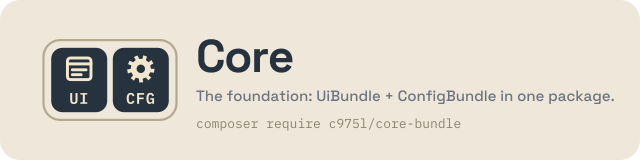

# c975L CoreBundle

The base of the c975L ecosystem in a single package: **ConfigBundle** (database-backed configuration, EasyAdmin dashboard, user accounts, health check, sitemaps) and **UiBundle** (page blocks, media library, theme, legal models, forms, emails). Two bundles, one package, one release.

[](https://github.com/975L/CoreBundle/blob/main/LICENSE)
[](https://packagist.org/packages/c975l/core-bundle)
[](https://packagist.org/packages/c975l/core-bundle)

## One package, two bundles



This is **not** a merged bundle. A Composer package is not a Symfony bundle: this package ships the two bundles unchanged, each with its own namespace, its own `services.yaml`, its own `configs.json`, its own translation domain and its own dashboard section.

```text
CoreBundle/
├── composer.json      ← the only one
├── ConfigBundle/      → c975L\ConfigBundle\
└── UiBundle/          → c975L\UiBundle\
```

There is **no `c975L\CoreBundle\` namespace**. The name `core-bundle` exists on Packagist only.

## Why they ship together

ConfigBundle and UiBundle referenced each other in their `composer.json`, in both directions:

- **Ui → Config** is deep and deliberate: `ConfigServiceInterface` is read everywhere, and every `*ProviderInterface` of the generic registry mechanism is declared in ConfigBundle.
- **Config → Ui** comes from the dashboard itself (`FontRegistry`, `FormThemeRegistry`, `StylesheetManagementRegistry`, `ScriptAdminRegistry`, `WhatsNewRegistry`) and from user accounts (`Form`/`FormField` + `EmailService`).

Two packages that require each other cannot be released independently, and neither can see the other's work-in-progress — only its last published version. They were never two layers; they were one layer billed as two. This package says so out loud.

## Installation

```bash
composer require c975l/core-bundle
```

Then register both bundles — they remain two entries:

```php
// config/bundles.php
return [
    // ...
    c975L\ConfigBundle\c975LConfigBundle::class => ['all' => true],
    c975L\UiBundle\c975LUiBundle::class => ['all' => true],
];
```

## Documentation

Each bundle keeps its own README, unchanged:

- [ConfigBundle](ConfigBundle/README.md)
- [UiBundle](UiBundle/README.md)

Its history, on the other hand, is the package's: [ChangeLog.md](ChangeLog.md) and [UPGRADE.md](UPGRADE.md) carry both bundles from here on. Each bundle's own files stop at its last published release — `v5.17.1` for ConfigBundle, `v1.17.0` for UiBundle — and are kept as archives.

## Quality checks

The seven checks the CI runs live in `composer.json` alone, as one list:

```bash
composer qa
```

`composer run -l` names what each one covers, and each is callable on its own (`composer audit-deps`, `cs`, `fixer`, `stan`, `stan-scaffold`, `rector`, `test`). The workflow calls those same scripts, so a check is never declared twice.

`audit-deps` is `composer audit`: it matches the resolved dependencies against the Packagist security advisories, which is where a known CVE in a dependency gets caught — before the push, not once a site has deployed it. Abandoned packages are reported without failing the run.

`rector` runs `--dry-run`, so it reports rather than rewrites, over the same sets `SymfonyMigrate.sh` gives a site. It covers `scaffold/` next to each bundle's own code: what is left unmodernised here gets rewritten in the application, where the rewritten file no longer matches the hash `ScaffoldInstaller` recorded, and the site is then told forever it customized a file it never touched.

A development machine's `vendor/` symlinks the sibling repositories, which expose code no tag has published yet — code the CI never sees. `bin/ci.sh` replays `composer qa` on a copy of the repository whose dependencies are resolved from Packagist, uncommitted changes included:

```bash
bin/ci.sh
```

## Migrating from `c975l/config-bundle` / `c975l/ui-bundle`

See [UPGRADE.md](UPGRADE.md). In short: replace the two requirements with `c975l/core-bundle`. **No PHP `use`, no `@c975LUi/…` template reference, no translation key and no `bundles.php` entry changes** — the namespaces are the same ones.

## License

MIT — see [LICENSE](LICENSE).
